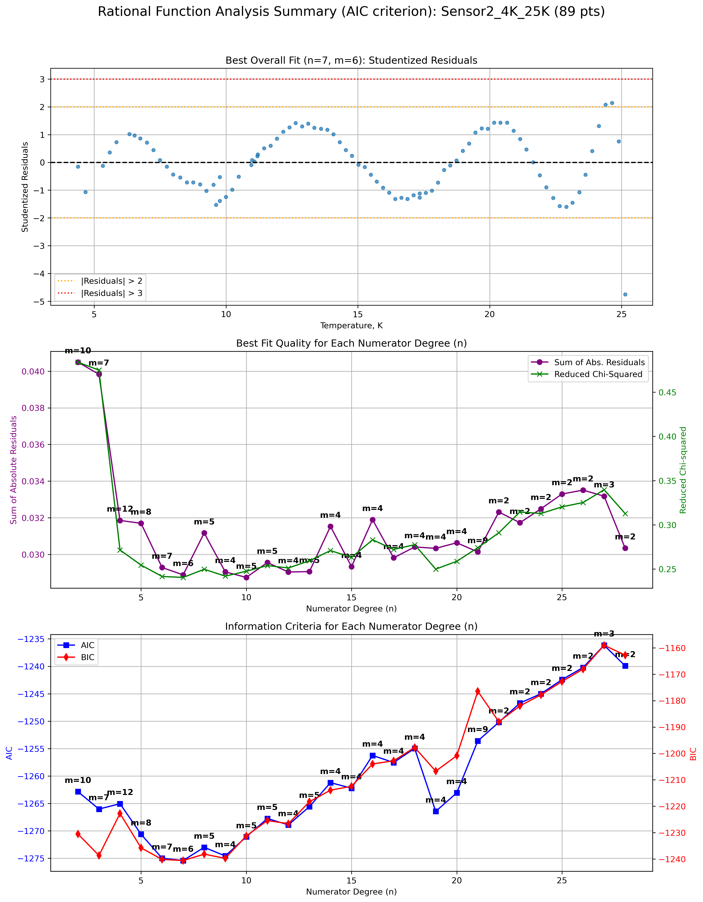

# PrecisionThermometryFramework

**PrecisionThermometryFramework** is a high-performance metrological suite designed for the rigorous demands of **high-precision thermometry**. While optimized for the extreme challenges of the cryogenic range, the framework provides a universal analytical engine suitable for any high-accuracy temperature sensor calibration (SPRTs, PRTs, Diodes, etc.) across a broad temperature ranges.

[](https://opensource.org/licenses/MIT)
[](https://doi.org/10.5281/zenodo.18921803)
[]()

## 🔬 Key Features

* **Sensor-Agnostic Input Logic**: Intelligent column mapping for both Resistors ($R$, $Resistance$) and Diode sensors ($U$, $V$, $Voltage$). Automatically handles temperature aliases ($T$, $Temp$, $Temperature$).
* **ITS-90 Precision Calibration**: Full implementation of the International Temperature Scale of 1990 for Standard Platinum Resistance Thermometers (SPRTs).
* **Rational Function Engine**: Automated 2D grid scanning for optimal numerator ($n$) and denominator ($m$) topological pairs (Padé approximants) using AIC/BIC criteria.
* **Piecewise Topology with $C^0$ Continuity**: Intelligently sub-divides datasets into thermal segments while mathematically enforcing boundary constraints (Knot Optimization).
* **Robust Outlier Rejection**: Advanced statistical pruning using Z-score, IQR, and Studentized Residuals via Hat Matrices.

## 📊 Supported Data Format
The framework is designed to be flexible. Your input CSV can use either Western (`,`) or European (`;`) separators. Column headers are case-insensitive and support the following aliases:

| Internal Variable | Supported CSV Headers (Aliases) |
|:------------------|:-------------------------------|
| **Signal (Y)** | `R`, `U`, `V`, `Voltage`, `Resistance` |
| **Temperature (X)**| `T`, `Temp`, `Temperature`, `t` |
| **Uncertainties** | `Rstd`, `Ustd`, `Vstd`, `Tstd`, `Temp_std` |.

## 📊 Visual Examples

<p align="center">
  
  <br>
  <em>Example of a generated diagnostic plot showing studentized residuals and optimal model topology.</em>
</p>

## 📂 Project Structure

<details>
  <summary>Click to expand full project structure</summary>

    PrecisionThermometryFramework/
    ├── data/                        # Input CSV/TDMS calibration datasets
    ├── examples/                    # Sample outputs and demonstration plots
    ├── interactive_handlers.py      # CLI menus and workflow orchestration
    ├── main.py                      # Application entry point
    ├── environment.yml              # Conda environment definition
    ├── requirements.txt             # Pip dependencies list
    ├── .gitignore                   # Git exclusion rules
    └── fitting_analysis_scripts/    # Core mathematical and analytical backend
        ├── __init__.py              # Python package marker
        ├── analyzer.py              # Global statistical fitting algorithms
        ├── data_loader.py           # I/O operations and dataset parsing
        ├── data_saver.py            # Metrological report structuring
        ├── dataset_combiner.py      # Piecewise logic & C0 knot optimization
        ├── function_defs.py         # Mathematical model libraries
        ├── its90_calculator.py      # ITS-90 fixed-point & SPRT algorithms
        ├── logger_setup.py          # Standardized logging for audit trails
        ├── outlier_analyzer.py      # Anomaly detection (Z-score, Hat Matrix)
        ├── plotter.py               # Vector graphics & diagnostic plotting
        ├── rational_function_handler.py # Padé approximant 2D optimization
        ├── residual_comparator.py    # Cross-validation & comparison
        └── subset_generator.py      # Data reduction & validation tools

</details>

## 🚀 Installation

You can set up the environment using either **Anaconda (Recommended)** or standard Python **pip**.

### Option A: Anaconda / Miniconda
1. Clone the repository:
   ```bash
   git clone https://github.com/YourUsername/PrecisionThermometryFramework.git
   cd CalibrationFramework
   ```
2. Create the virtual environment from the YAML file:
   ```bash
   conda env create -f environment.yml
   ```
3. Activate the environment:
   ```bash
   conda activate calibration_framework
   ```

### Option B: pip
1. Clone the repository and navigate to the folder.
2. Install the required dependencies:
   ```bash
   pip install -r requirements.txt
   ```

## ⚙️ Usage

To launch the interactive calibration suite, simply run the main script from your terminal:

```bash
python main.py
```

Follow the on-screen CLI prompts to:
1. Load a dataset from the `data/` folder.
2. Select a fitting model (Polynomial, Rational, or ITS-90).
3. Apply domain normalizations (e.g., $W = R/R_{TPW}$).
4. Enter the interactive analysis loop to clean outliers, split segments, or cross-validate.

All generated reports and plots will be automatically saved in a structured `results/` directory at the project root.

## 📊 Examples & Validation
The `examples/` directory provides a comprehensive validation suite for high-precision sensor calibration:

- **Model Selection**: `summary_plots_aic_criterion.png` illustrates the automated grid-search for optimal (n, m) rational function degrees based on information criteria.
- **Piecewise Integrity**: `piecewise_diagnostics.png` shows localized residual analysis across different temperature segments.
- **Independent Validation**: `raw_residuals_comparison.png` demonstrates model performance against a secondary dataset, including segment boundary verification.
- **Full Reproducibility**: Includes unified CSV reports with coefficients, fit statistics, and residual tables for both global and piecewise models.

## 👤 Author & Maintainer
* **Grzegorz Szklarz** - *Lead Developer & Architect* - [GitHub Profile](https://github.com/GrzegorzSzklarz)

## 🎓 Academic Citation
While the software was developed exclusively by **Grzegorz Szklarz**, the methodology and research context are described in the following publication. If you use this framework, please cite both the software and the paper:

**Software Citation:**
> Szklarz, G. (2026). PrecisionThermometryFramework (v1.0.0). Zenodo. https://doi.org/10.5281/zenodo.18921803

**Paper Citation:**
> Szklarz, G., Nikonkov, R., and Kowal, A., "Analytical framework for high-precision cryogenic thermometry: Characterization of RhFe and PtCo sensors below 25 K", *[Journal Name]*, (Under Review, 2026).

## 📜 License
This project is licensed under the **MIT License** - see the [LICENSE](LICENSE) file for details.
